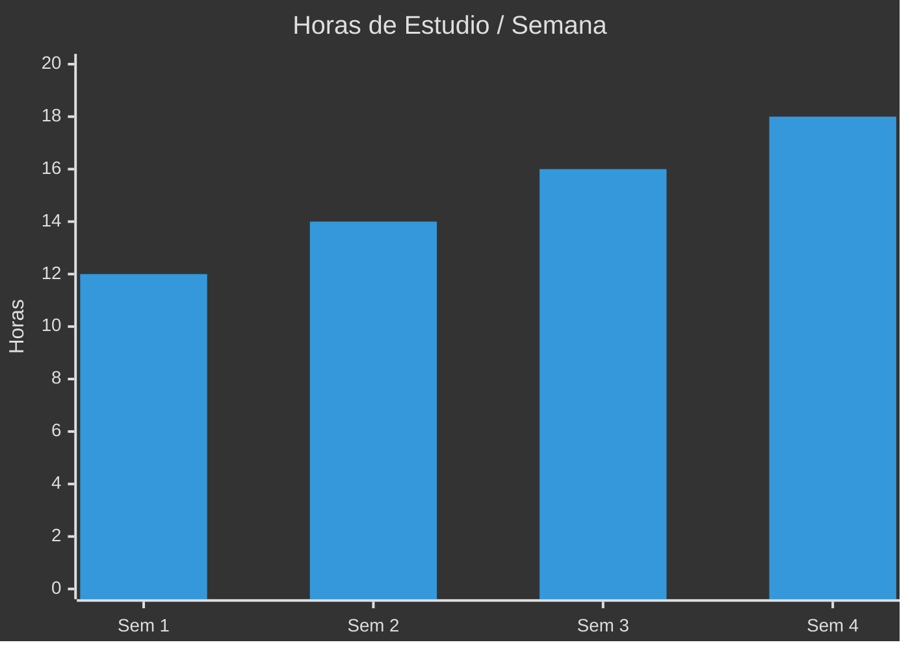

```text
╔══════════════════════════════════════════════════════════════╗
║           LUIS TRICHE · DATA ANALYTICS ENGINEER             ║
║     De la pedagogía a los datos — 50 proyectos, un imperio  ║
╚══════════════════════════════════════════════════════════════╝
```

**Data Analyst** · **Lic. Ciencias de la Educación** · **Google Certified (3x)**  
Actualmente: **Lic. en Ciencia de Datos para Negocios (UNRC)**  

Transformo datos en decisiones. Construyo sistemas, no solo dashboards.

---

### 🏆 Sistema Fénix V2 — Data Science Empire

> Monorepo de 50 proyectos de Ciencia de Datos + Hub Streamlit + Dashboard de Dominio + IA Local (Ollama)

[](https://github.com/luistriche/Fenix-Data-Science-Empire)

| Fase | Enfoque | Proyectos | Estado |
|------|---------|-----------|--------|
| 🧱 Cimientos | Python · SQL · Streamlit · APIs | 01–10 | Activos |
| ⚔️ Estrategia | Power BI · Tableau · Storytelling | 11–20 | Blueprint |
| 🔮 Predictiva | ML · Scikit-learn · Time Series | 21–30 | Blueprint |
| 🧠 Psico-IA | NLP · LLMs · Ollama · Edge AI | 31–40 | Blueprint |
| 🏢 Enterprise | AWS · MLOps · Producción | 41–50 | Blueprint |

---

### 🛠️ Arsenal Técnico

```
Python · SQL · R · Power BI · AWS · Streamlit · Plotly
Pandas · NumPy · Scikit-learn · Matplotlib · Seaborn
Ollama (Edge AI) · Git · Linux · edge-tts · ffmpeg
```

**Certificaciones:**  
✅ Google Data Analytics · ✅ Google Advanced Data Analytics · ✅ Google Business Intelligence

---

### 📂 Proyectos Destacados

| Proyecto | Stack | Link |
|----------|-------|------|
| 🏆 **Fénix Data Science Empire** (50 proyectos) | Python · Streamlit · Ollama · Plotly | [Repo](https://github.com/luistriche/Fenix-Data-Science-Empire) |
| 🤖 **AI Data Cleaning Agent** | Gemini AI · Python · Pandas | [Repo](https://github.com/luistriche/ai-data-cleaning-agent) |
| 🌱 **Suelo Inteligente ML** | KNN · NOM-021 · Scikit-learn | [Repo](https://github.com/luistriche/suelo-inteligente-ml) |
| 📊 **Población · Markov** | Cadenas de Markov · Simulación | [Repo](https://github.com/luistriche/poblacion-migracion-markov) |
| 📁 **Portafolio Datos** | Casos prácticos · Informes | [Repo](https://github.com/luistriche/portafolio-analisis-datos) |
| 📊 **Dashboard Estadística UNRC** | R · Shiny · Equipo | [Repo](https://github.com/luistriche/dashboard-estadistica-unrc-) |

---

### 📊 Métricas de Dominio



---

### 📬 Contacto

- ✉️ luistriche501@gmail.com  
- 📍 Tijuana, B.C., México  
- 🔗 [LinkedIn](https://linkedin.com/in/luistriche)  

---

> *"No se trata de ser el mejor. Se trata de ser imparable."*
